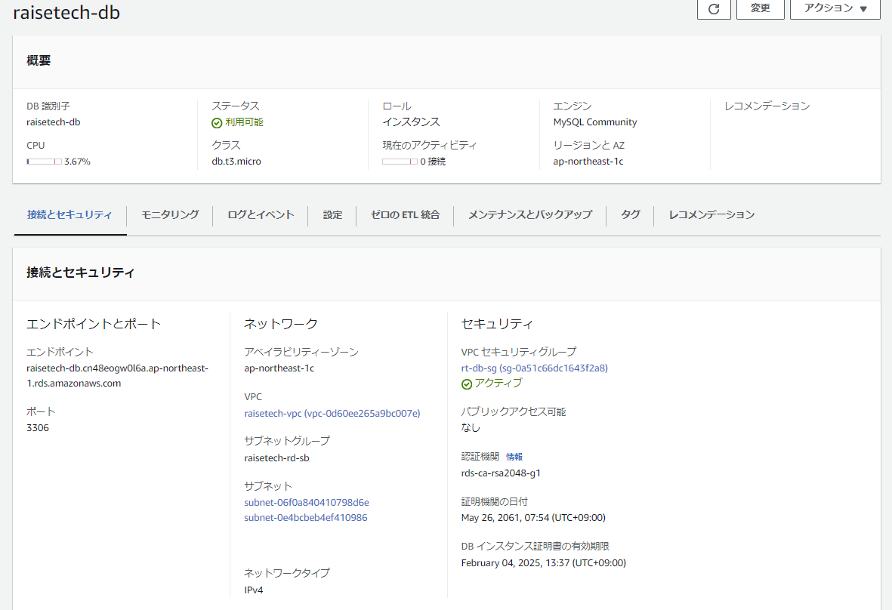
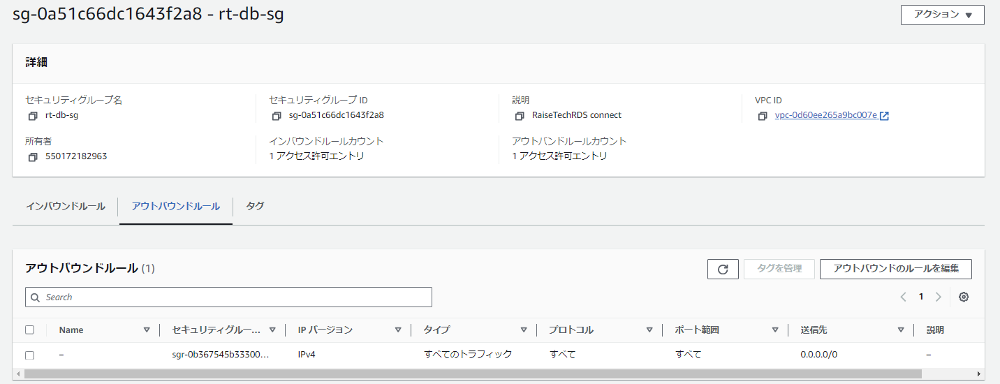

## 第4回課題提出

1.VPC

- サブネット情報

2.EC2

- セキュリティグループ ルール

3.RDS

- セキュリティグループ ルール

4.EC2⇒RDS 接続確認

### 学んだこと、感じたこと

Teratermで接続する際、キーペアはED25519で作成しなければいけない部分で躓きました。

以前はそんなことなかったような・・・？違うツールを使っていたのか、いろいろと忘れている部分も多く、こうして触れていくことは大事だなと感じました。

勉強になります。