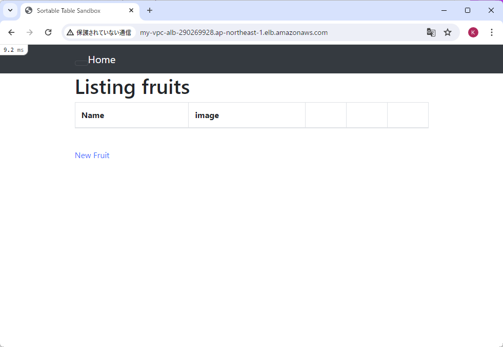
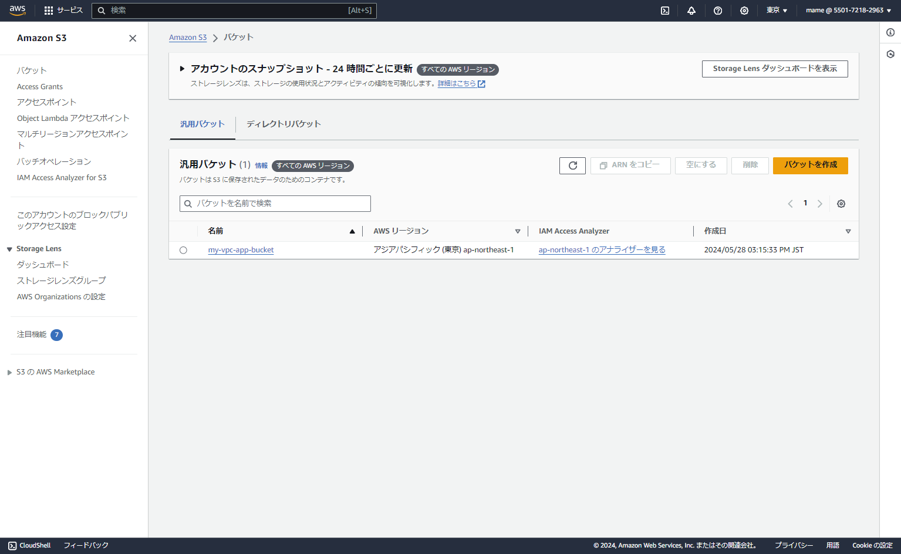
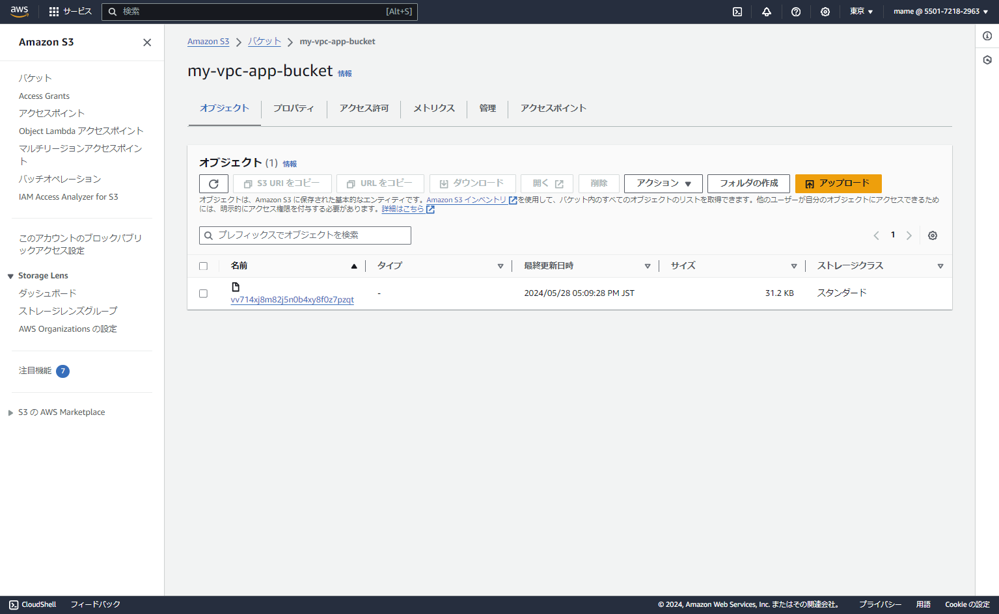

## 第5回課題提出

1.nginx起動

2.nginx + puma で起動

3.ロードバランサー経由で接続確認

- ロードバランサー ターゲットグループ

- ロードバランサー セキュリティグループ

4.保存先をS3に変更

5.構成図

### 感想

少し間が空いてしまい、アプリケーションの仕様がunicornからpumaに変わっていたので再構築しました。

設定ファイルをいろいろ見直したので、少し理解が深まった気がします。
