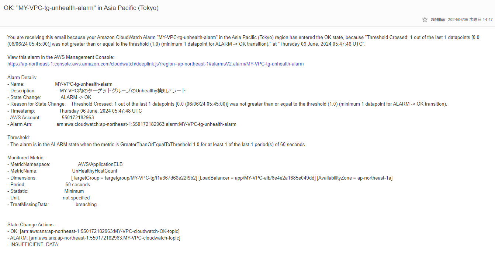
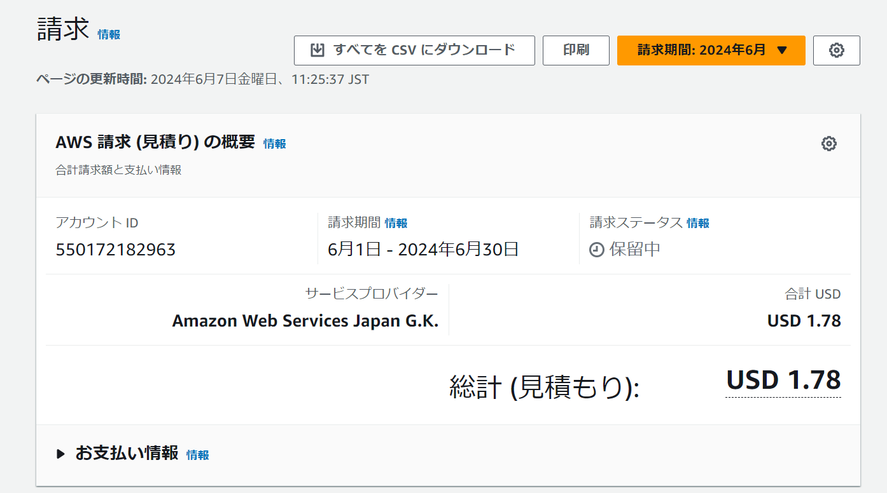

## 第6回課題提出

1.CloudTrailイベント確認 
⇒イベント名、含まれている内容を3つピックアップ

- イベント名：CheckMfa

- "eventTime": "2024-06-06T00:11:11Z"
- "eventSource": "signin.amazonaws.com"
- "eventName": "CheckMfa"

2.CloudWatchアラーム設定 
⇒ALBアラームを設定し、メール通知

- Railsを停止し、アラーム状態にする
 
- アラートメール受信

- Railsを起動し、通常状態にする

- アラーム解除メール受信

3.AWS利用料見積
- AWS Pricing Calculator
https://calculator.aws/#/estimate

4.現在の利用料金 

## 感想
利用料金について、アカウント作成から一年過ぎているので現在無料枠はありませんでしたが、スナップショットの削除忘れ等もあり、意外と無駄な課金があることに気付いたので、整理しました。 
ログの必要性は理解しているので、設定方法を学べてよかったです。