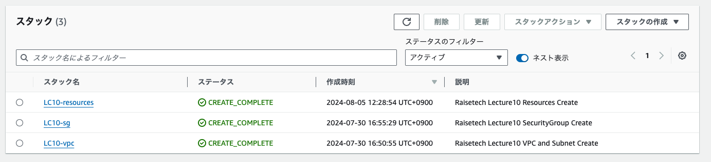
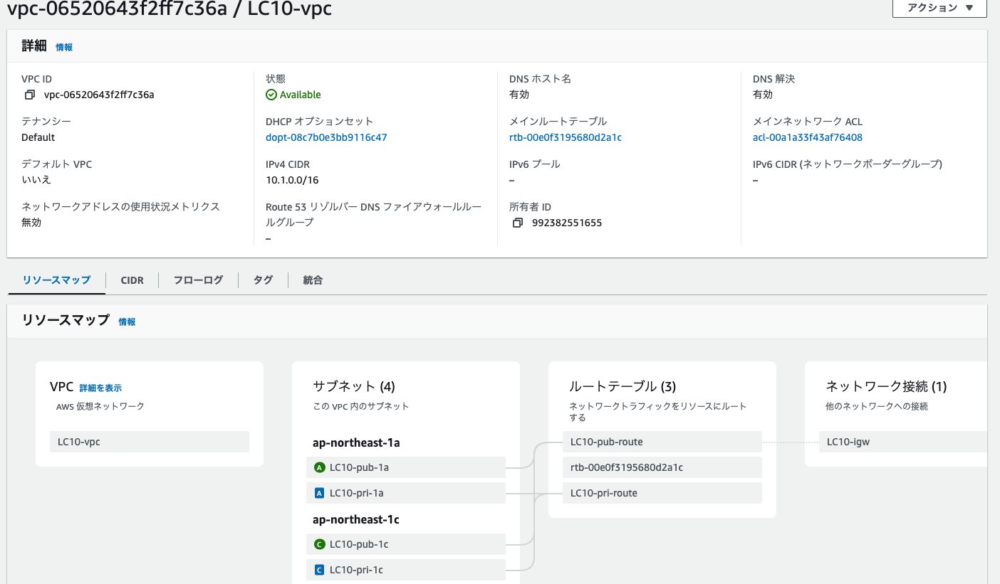
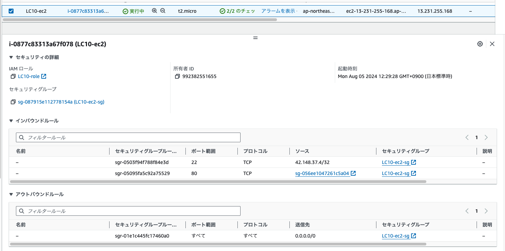
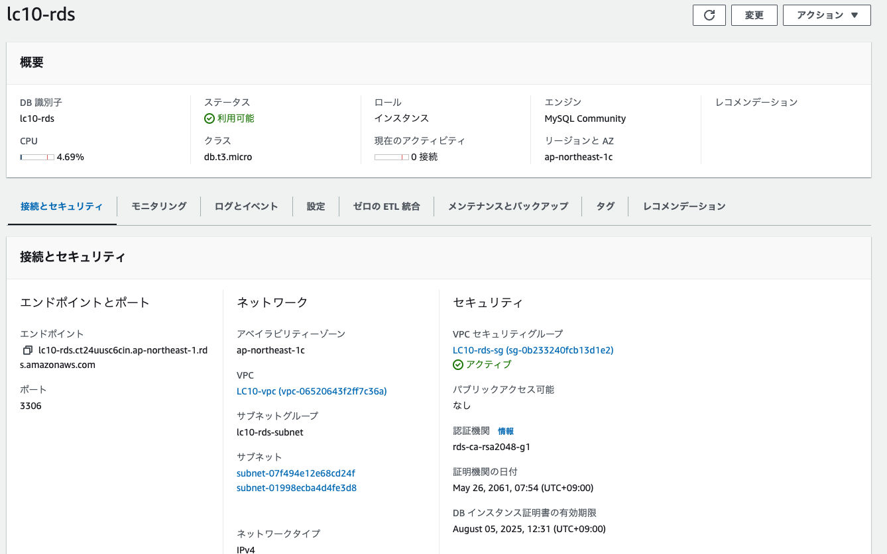
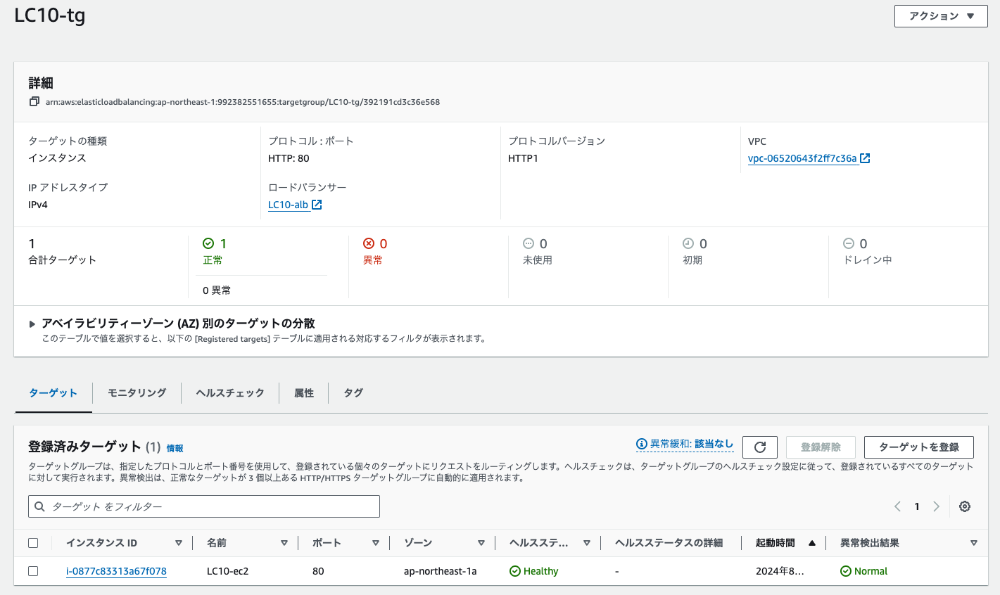
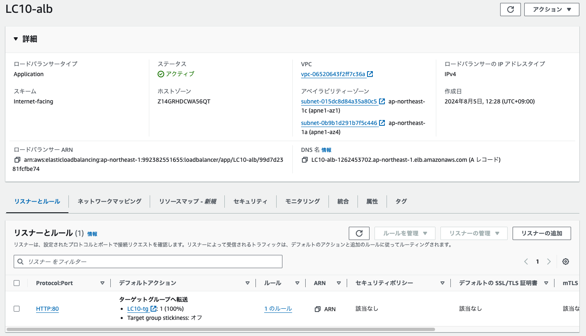
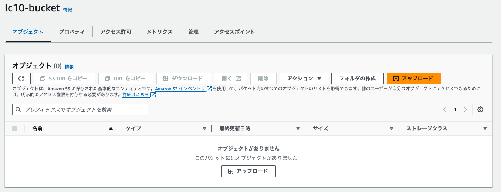
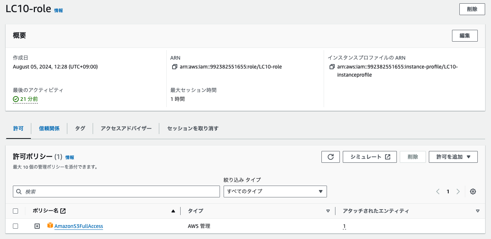

## 第10回課題提出

### CloudFormationにて、現在までの環境構築を自動化する

1. VPC、サブネットの構築 
[LC10-Template-vpc.yml](/cloudformation/LC10-Template-vpc.yml) 

2. セキュリティグループ 
[LC10-Template-securitygroup.yml](/cloudformation/LC10-Template-securitygroup.yml) 

3. 各種リソース作成 
[LC10-Template-resources.yml](/cloudformation/LC10-Template-resources.yml) 
 

- スタック 
 

- VPC 
 

- EC2 
 

- RDS 
 

- ターゲットグループ 
 

- ALB 
 

- S3 
 

- IAMロール 
 

## 感想
画面上で行っている設定項目と同じ内容のコードを探すのが大変でした。 
まだまだ細かい設定ができると思いますが、今後も調べながら進めるしかないかなと思います。 
AWSを学ぶにあたり自動化部分が一番気になっていたところなので、やっと辿り着けてよかったです。