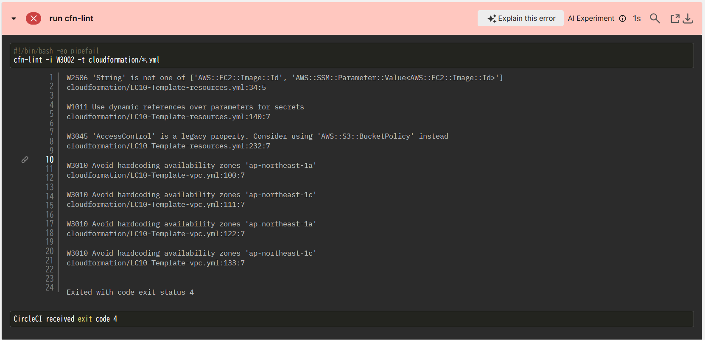
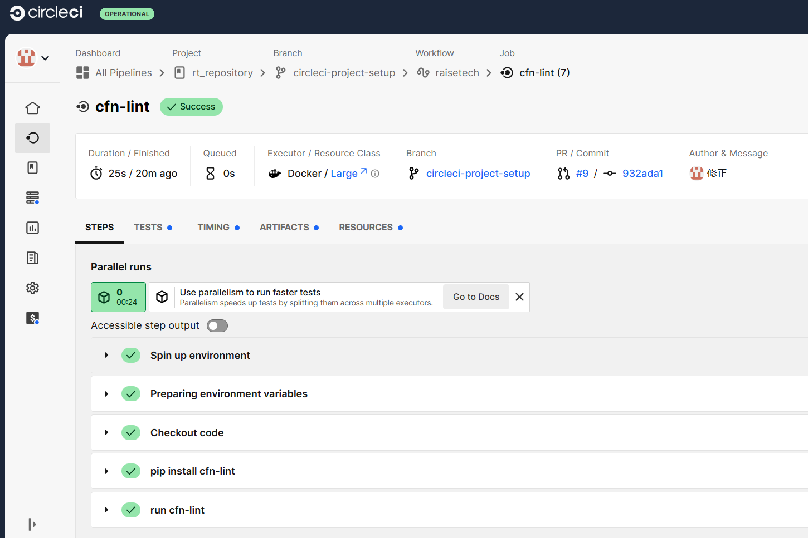

## 第12回課題提出

### CiecleCiを使用してサンプルコンフィグを実行する

1.アカウント登録
Githubアカウントと連携して登録する

2.スタートアップガイドに基づいて内容を確認
https://circleci.com/docs/ja/getting-started/

3.config.ymlをサンプルコンフィグに書き換え
```
version: 2.1
orbs:
  python: circleci/python@2.0.3
jobs:
  cfn-lint:
    executor: python/default
    steps:
      - checkout
      - run: pip install cfn-lint
      - run:
          name: run cfn-lint
          command: |
            cfn-lint -i W3002 -t cloudformation/*.yml

workflows:
  raisetech:
    jobs:
      - cfn-lint
```

4.commit、リモートリポジトリにpush

5.CircleCI確認⇒Faildになっているのでエラー内容を確認



警告コード<br>
・W2506<br>
指定された文字列が期待値と異なる<br>
・W1011<br>
シークレットパラメータよりも動的参照の使用を推奨する<br>
・W3045<br>
AccessControlプロパティの使用は古い形式であり、現在はBacketPolicyの使用を推奨する<br>
・W3010<br>
指定されたゾーンが使用できなくなった場合問題が発生する可能性があるので、使用可能なゾーンを動的参照する関数の使用を推奨する<br>
⇒いずれも警告であり、必須事項ではない。
脆弱性等の観点から改めることが望ましいが、今回は動作確認を主体とするため、config.ymlの書き換えにて対応する<br>

```
version: 2.1
orbs:
  python: circleci/python@2.0.3
jobs:
  cfn-lint:
    executor: python/default
    steps:
      - checkout
      - run: pip install cfn-lint
      - run:
          name: run cfn-lint
          command: |
            cfn-lint -i W3002 W2506 W1011 W3010 W3045 -t cloudformation/*.yml

workflows:
  raisetech:
    jobs:
      - cfn-lint
```

6.再コミット、再push

7.結果がSuccessになったことを確認する




## 感想
CICDツールについて理解できました。
もっといろいろ学んでいきたいと思います。